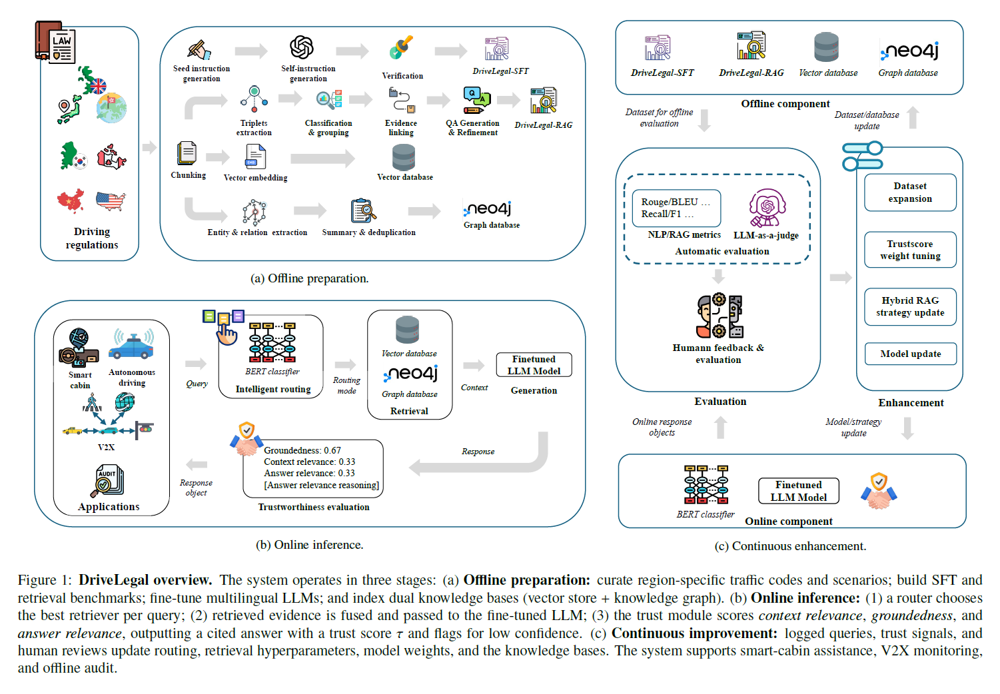

# DriveLegal: Toward Legally Compliant Driving via Trustworthy Hybrid Retrieval‑Augmented LLMs
[](https://www.sciencedirect.com/science/article/pii/S0957417426005063)
[](supplemental.pdf)


<!-- use fig1.png under media folder -->
<p align="center">
  
</p>


### 🧾 **Abstract**

Autonomous vehicles (AVs) face persistent challenges in complying with complex and evolving traffic laws. Existing approaches, including rule-based, learning-based, and large language model (LLM) methods, each face limits in adaptability, generalizability, or trustworthiness. We present DriveLegal, a modular legal-interpretation framework for downstream autonomous driving applications. DriveLegal pairs fine-tuned multilingual  LLMs with an intelligent hybrid retrieval module that routes between vector search  and knowledge graph, then returns concise, cited answers. A  trust layer scores context relevance, groundedness, and answer relevance and supports continuous improvement through periodic automatic signals and targeted human review. We introduce the DriveLegal datasets for supervised fine-tuning and for retrieval and graph reasoning. Across benchmarks and case studies in smart cabin and vehicle-to-everything (V2X) settings, the hybrid retrieval strategy improves contextual accuracy and reduces hallucination while producing jurisdiction-aware outputs suitable for compliance checks, incident analysis, and reporting. 


## Citation:
If you find our work useful, please consider citing it as follows:
```
@article{huang2026131593,
title = {DriveLegal: Toward Legally Compliant Driving via Trustworthy Hybrid Retrieval‑Augmented LLMs},
journal = {Expert Systems with Applications},
pages = {131593},
year = {2026},
issn = {0957-4174},
doi = {https://doi.org/10.1016/j.eswa.2026.131593},
url = {https://www.sciencedirect.com/science/article/pii/S0957417426005063},
author = {Shucheng Huang and Chen Sun and Minghao Ning and Yufeng Yang and Changye Ma and Jiaming Zhong and Keqi Shu and Freda Shi and Amir Khajepour},
}
```

